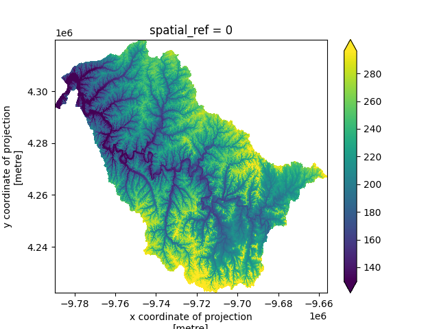

# Examples

The example notebooks have several dependencies. If you have [pixi](https://pixi.sh)
installed, the dev environment includes everything you need:

```bash
pixi install -e dev
```

Alternatively, you can create an environment with `conda` (or `mamba` or `micromamba`):

```bash
conda create -n dev tiny_retriever ipykernel ipywidgets rioxarray geopandas matplotlib
```

<div class="grid cards" markdown>

- [{ loading=lazy }](hydrodata.ipynb "Hydrology Data")
    **Hydrology Data**

</div>
